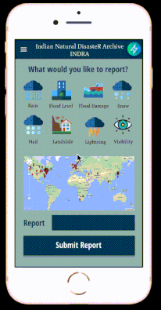
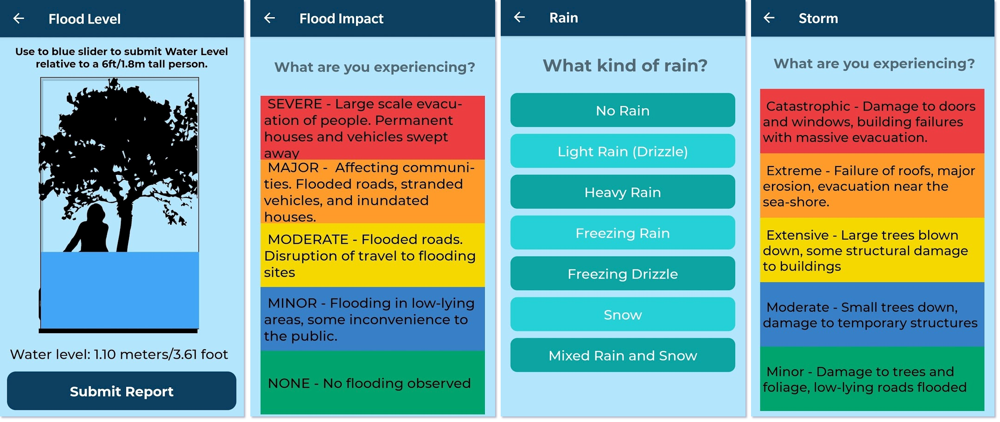

# International Natural Disasters Research and Analytics (INDRA) Reporter

## Project INDRA
INDRA Reporter is a free app for crowdsourcing reports on weather and water-related natural hazards such as floods, heavy rains, landslides etc. from citizen scientists. Project INDRA is building a comprehensive multi-platform framework for crowdsourcing disaster data using apps, chat bots, web forms, social media sensors etc.

## Tech Stack

For the app, the following technologies were used

* React Native
* Django REST Framework
* Postgresql

# Demo

